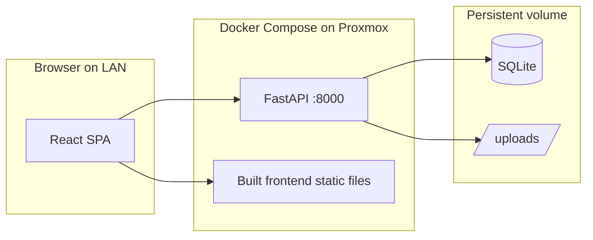
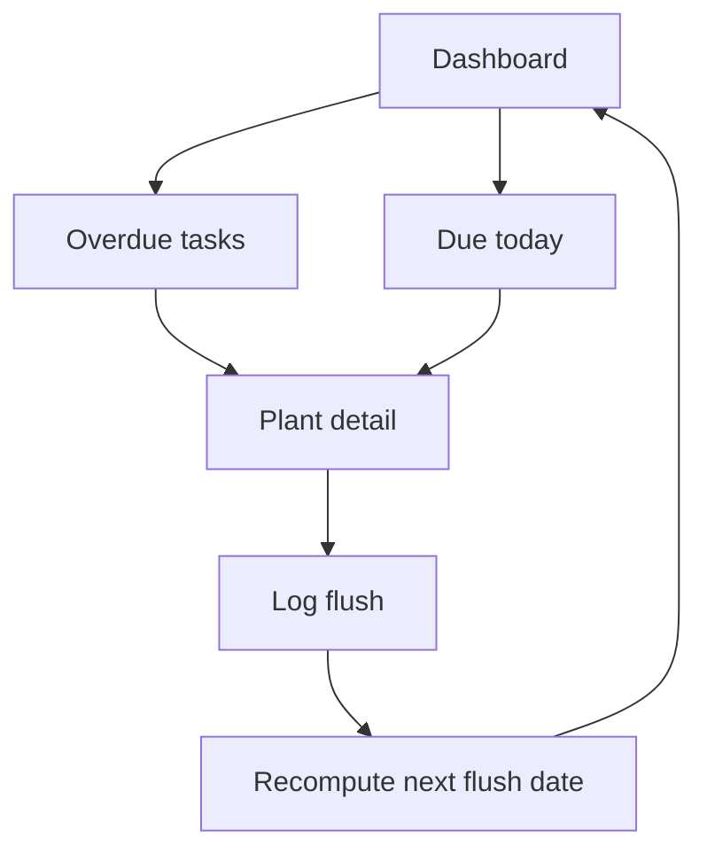

# Semi-Hydro Plant Tracker — Phased Build Plan

## Architecture



**Monorepo layout** (everything under [plant-tracking/](plant-tracking/)):

```
plant-tracking/
├── frontend/          # Vite React TS (npm create)
├── backend/
│   ├── app/           # FastAPI app package
│   ├── alembic/       # migrations
│   └── pyproject.toml # uv-managed deps
├── data/              # gitignored runtime data (mounted in Docker)
│   ├── plant_tracking.db
│   └── uploads/
├── docker-compose.yml
├── Dockerfile         # multi-stage: build frontend + run API
├── Makefile           # dev shortcuts
└── README.md
```

**Key decisions (with rationale):**

| Choice | Why |
|--------|-----|
| **uv** for Python | Fast, modern, lockfile; `uv init` / `uv add` replace hand-written `requirements.txt` |
| **npm create vite** for frontend | Official React+TS template; no hand-rolled webpack config |
| **Single Docker image** | API serves built SPA + `/api` routes — one port, simple LAN access |
| **No auth** | LAN-only; bind to host port, do not port-forward on router |
| **TanStack Query + React Router** | Standard pairing for CRUD apps; minimal boilerplate |
| **Plain CSS or Tailwind** (Vite template ships with neither by default) | Add Tailwind in Phase 1 via `npm install -D tailwindcss @tailwindcss/vite` — fast styling without a component library yet |

---

## Phase 0 — Scaffolding (do this first)

Goal: runnable dev environment with health check, empty DB, and Docker skeleton. No domain features yet.

### 0a. Backend scaffold

```bash
cd plant-tracking
uv init backend --package
cd backend
uv add fastapi "uvicorn[standard]" sqlmodel alembic python-multipart pydantic-settings
uv add --dev pytest httpx ruff
uv run alembic init alembic
```

Hand-written pieces (small, unavoidable — no official `create-fastapi`):

- [`backend/app/main.py`](backend/app/main.py) — FastAPI app, CORS for `localhost:5173`, `GET /api/health`
- [`backend/app/config.py`](backend/app/config.py) — `pydantic-settings`: `DATABASE_URL`, `UPLOAD_DIR`, `DATA_DIR`
- [`backend/app/db.py`](backend/app/db.py) — SQLModel engine + `get_session` dependency
- Wire Alembic `env.py` to import `SQLModel.metadata` from your models package (empty initially)
- [`backend/app/models/__init__.py`](backend/app/models/__init__.py) — placeholder for models

### 0b. Frontend scaffold

```bash
cd plant-tracking
npm create vite@latest frontend -- --template react-ts
cd frontend
npm install
npm install react-router-dom @tanstack/react-query axios
npm install -D tailwindcss @tailwindcss/vite
```

Hand-written pieces:

- [`frontend/src/api/client.ts`](frontend/src/api/client.ts) — axios instance pointing at `VITE_API_URL` (default `http://localhost:8000`)
- [`frontend/src/App.tsx`](frontend/src/App.tsx) — React Router shell with placeholder pages: Dashboard, Plants
- Health-check page or banner confirming API connectivity

### 0c. Dev tooling

- [`Makefile`](Makefile): `make dev-api`, `make dev-web`, `make migrate`, `make test`
- Update [`.gitignore`](.gitignore): add `node_modules/`, `frontend/dist/`, `data/`, `*.db`
- [`.env.example`](.env.example): `DATABASE_URL=sqlite:///./data/plant_tracking.db`, `UPLOAD_DIR=./data/uploads`

### 0d. Docker skeleton

- **Multi-stage [`Dockerfile`](Dockerfile)**:
  1. Stage `frontend-build`: `npm ci && npm run build`
  2. Stage `runtime`: copy `backend/`, install with `uv`, copy `frontend/dist` into `app/static/`, expose `:8000`
- [`docker-compose.yml`](docker-compose.yml):
  - One service `app`, port `8000:8000`
  - Volume `./data:/data` for SQLite + uploads
  - `restart: unless-stopped`
- FastAPI mounts `StaticFiles` at `/` and API at `/api/*` (SPA fallback for client-side routes)

**Phase 0 done when:** `make dev-api` + `make dev-web` work locally; `docker compose up` serves the SPA and `GET /api/health` returns OK.

---

## Phase 1 — Plants CRUD

Goal: core entity — list, create, edit, delete plants.

### Data model

```python
# backend/app/models/plant.py
class Plant(SQLModel, table=True):
    id: int | None = Field(default=None, primary_key=True)
    name: str
    species: str | None = None
    location: str | None = None
    # scheduling fields added in Phase 3 — leave out for now
    created_at: datetime = Field(default_factory=utcnow)
    updated_at: datetime = Field(default_factory=utcnow)
```

### API (`/api/plants`)

| Method | Path | Action |
|--------|------|--------|
| GET | `/api/plants` | List all |
| POST | `/api/plants` | Create |
| GET | `/api/plants/{id}` | Detail |
| PATCH | `/api/plants/{id}` | Update |
| DELETE | `/api/plants/{id}` | Delete |

Use separate Pydantic schemas: `PlantCreate`, `PlantUpdate`, `PlantRead` (SQLModel makes this easy).

### Frontend

- `/plants` — table/cards of all plants
- `/plants/new` — create form
- `/plants/:id` — detail page (shell for notes/photos/actions later)

Run: `uv run alembic revision --autogenerate -m "add plants"` → `uv run alembic upgrade head`

---

## Phase 2 — Notes and action log

Goal: per-plant notes and dated action history (the journal).

### Data models

```python
class Note(SQLModel, table=True):
    id: int | None = Field(default=None, primary_key=True)
    plant_id: int = Field(foreign_key="plant.id", index=True)
    content: str
    created_at: datetime

class ActionType(str, Enum):
    FLUSH = "flush"
    RESERVOIR_REFILL = "reservoir_refill"
    OTHER = "other"

class ActionEntry(SQLModel, table=True):
    id: int | None = Field(default=None, primary_key=True)
    plant_id: int = Field(foreign_key="plant.id", index=True)
    action_type: ActionType
    performed_at: date          # user-selected date
    notes: str | None = None
    created_at: datetime
```

### API

- `GET/POST /api/plants/{id}/notes`
- `DELETE /api/notes/{id}`
- `GET/POST /api/plants/{id}/actions`
- `DELETE /api/actions/{id}`

### Frontend (on plant detail page)

- Notes section: list + add form
- Action log: list with date, type, notes; "Log action" form with date picker and type dropdown

---

## Phase 3 — Flush scheduling (reservoir refill: log only for now)

Goal: reminders for **flush** only. Reservoir refills stay in the action log (Phase 2) with no interval or due-date logic yet.

### Rationale

- **Flush** — predictable interval (e.g. every 7 days); interval + next-due date + reminders fit well.
- **Reservoir refill** — usage varies; smart tracking (level % over time, full-refill events, estimated depletion) is useful later but not needed soon. You can see reservoir levels yourself. For now, log `reservoir_refill` actions as history only.

### Extend `Plant` model

```python
flush_interval_days: int | None = None
next_flush_date: date | None = None
# No reservoir_refill_interval_days or next_reservoir_refill_date in this phase
```

### Business logic ([`backend/src/backend/services/schedule.py`](backend/src/backend/services/schedule.py))

- When user sets flush interval + optional anchor/last-flush date → compute `next_flush_date`
- When a `FLUSH` action is logged → `next_flush_date = performed_at + flush_interval_days` (if interval set)
- `RESERVOIR_REFILL` and `OTHER` actions do **not** change schedule
- Expose `PATCH /api/plants/{id}/schedule` for flush interval and `next_flush_date` (manual override)

### Frontend

- **Schedule** section on plant detail: flush interval (days), next flush date, manual override
- Badge on plant list when flush is **overdue** or **due today**
- Action log unchanged — still log reservoir refills; no schedule UI for refill

### Phase 5 dashboard (preview)

Dashboard will only surface **flush** tasks until smart reservoir phase exists.

---

## Phase 7 (much later) — Smart reservoir tracking

Goal: estimate when refill is needed from observed usage, not a fixed interval.

### Ideas (not scoped for implementation yet)

- Log **full refill** events (already possible via action log; may add explicit action subtype or flag)
- Log **level readings** at rough times: e.g. “~80%”, “~50%” as dated entries
- Backend estimates consumption rate between readings → predicted `next_reservoir_refill_date`
- Optional reminders when estimate crosses a threshold

Defer until flush scheduling + photos + dashboard are solid.

---

## Phase 4 — Photos on disk

Goal: upload, list, view, delete photos per plant.

### Data model

```python
class Photo(SQLModel, table=True):
    id: int | None = Field(default=None, primary_key=True)
    plant_id: int = Field(foreign_key="plant.id", index=True)
    filename: str           # original name
    stored_name: str        # uuid.ext on disk
    caption: str | None = None
    taken_at: date | None = None
    uploaded_at: datetime
```

### Storage

- Files saved to `{UPLOAD_DIR}/{plant_id}/{uuid}.{ext}`
- Validate: max size (e.g. 10 MB), allow `image/jpeg`, `image/png`, `image/webp`
- `POST /api/plants/{id}/photos` — multipart upload (`python-multipart`)
- `GET /api/photos/{id}/file` — serve file from disk
- `DELETE /api/photos/{id}` — remove DB row + file

### Frontend

- Photo gallery on plant detail
- Upload with optional caption and taken-at date
- Thumbnail grid, click to enlarge

---

## Phase 5 — Dashboard (today + overdue)

Goal: main page answering "what do I need to do?"

### API

`GET /api/dashboard` returns flush tasks only (reservoir added in Phase 7 when estimates exist):

```json
{
  "overdue": [
    { "plant_id": 1, "plant_name": "Monstera", "task": "flush", "due_date": "2026-07-01" }
  ],
  "due_today": [
    { "plant_id": 2, "plant_name": "Pothos", "task": "flush", "due_date": "2026-07-04" }
  ]
}
```

Query logic: for each plant with a non-null `next_flush_date`, classify as overdue (`< today`) or due today (`== today`). Sort overdue by oldest first.

### Frontend

- `/` (Dashboard): two sections — **Overdue** (red/warning) and **Due Today**
- Each row links to plant detail; optional quick-action button to log the action inline



---

## Phase 6 — Proxmox deployment

Goal: run reliably on your home server, LAN-only.

### Proxmox setup (suggested)

1. Create an **LXC or small VM** (1 vCPU, 1–2 GB RAM is plenty) on your LAN
2. Install Docker + Docker Compose inside it
3. Clone repo, copy `.env.example` → `.env`, run `docker compose up -d`
4. Access at `http://<lxc-ip>:8000` from any device on LAN

### Hardening (LAN-only, no auth)

- **Do not** port-forward 8000 on your router
- Optionally put **Caddy or nginx** in front on the LXC for `http://plants.home` via local DNS (Pi-hole, AdGuard, or router DNS)
- Set `restart: unless-stopped` in compose
- Back up `./data/` regularly (SQLite file + `uploads/` folder) — a simple cron `tar` to another Proxmox storage or NAS is enough

### Optional later improvements (out of initial scope)

- shadcn/ui for polished components
- Image thumbnails (Pillow resize on upload)
- Bulk "mark done" on dashboard
- Export/backup API endpoint

---

## Suggested build order (summary)

| Phase | Deliverable | Est. effort |
|-------|-------------|-------------|
| 0 | Scaffolding, health check, Docker | ~2–3 hrs |
| 1 | Plants CRUD | ~2 hrs |
| 2 | Notes + action log | ~2 hrs |
| 3 | Flush scheduling + reminders | ~2 hrs |
| 4 | Photo upload/view | ~2–3 hrs |
| 5 | Dashboard | ~1–2 hrs |
| 6 | Proxmox deploy + backup notes | ~1 hr |

**Total: ~12–16 hours** spread across sessions — each phase is independently testable.

---

## What we will NOT do in early phases

- Authentication / user accounts
- PostgreSQL (SQLite is fine for single-user; one file to back up)
- Full-stack FastAPI template (includes auth, PostgreSQL, Celery — overkill)
- Internet exposure or HTTPS (add only if you later reverse-proxy with TLS on LAN)
